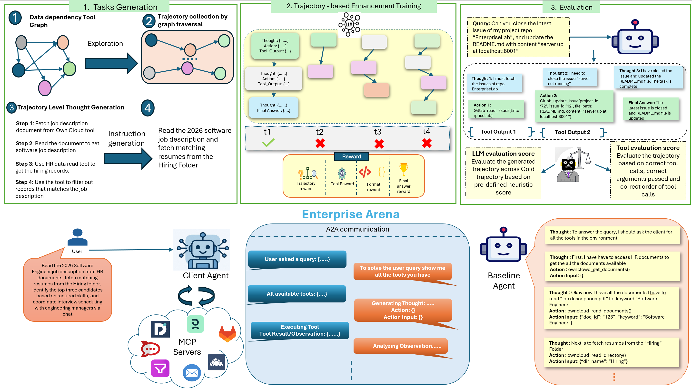

<header style="background: linear-gradient(135deg, #667eea 0%, #764ba2 100%); color: white; padding: 60px 40px; text-align: center; border-radius: 8px; margin-bottom: 40px;">
  <h1 style="color: white; font-size: 2.5em; margin-bottom: 20px;">EnterpriseLab: A Full-Stack Platform for Developing and Deploying Agents in Enterprises</h1>
  <p style="color: rgba(255,255,255,0.9); font-size: 1.2em; margin-bottom: 30px;">Unified infrastructure for training privacy-preserving, cost-effective enterprise AI agents</p>
  
  <div style="display: flex; gap: 15px; justify-content: center; flex-wrap: wrap; margin: 20px 0;">
    <span style="background: rgba(255,255,255,0.2); padding: 8px 16px; border-radius: 20px;">🏢 Enterprise AI</span>
    <span style="background: rgba(255,255,255,0.2); padding: 8px 16px; border-radius: 20px;">🤖 Agent Training</span>
    <span style="background: rgba(255,255,255,0.2); padding: 8px 16px; border-radius: 20px;">🔧 Tool Integration</span>
    <span style="background: rgba(255,255,255,0.2); padding: 8px 16px; border-radius: 20px;">💰 Cost Efficiency</span>
  </div>

  <p style="margin: 25px 0 10px; font-size: 1.1em; line-height: 1.6;">
  <strong>
    Ankush Agarwal<sup>1,*</sup>, 
    Harsh Vishwakarma<sup>1,*</sup>, 
    Suraj Nagaje<sup>1,*</sup>
  </strong><br>
  <span style="font-size: 0.95em; opacity: 0.85;">
    <sup>1</sup>Fujitsu Research India<br>
    <sup>*</sup>Equal contribution
  </span>
</p>

  <div style="display: flex; gap: 15px; justify-content: center; flex-wrap: wrap; margin-top: 30px;">
    <a href="https://arxiv.org/abs/2603.21630" style="background: white; color: #667eea; padding: 12px 24px; text-decoration: none; border-radius: 5px; font-weight: 600;">📄 Paper</a>
    <a href="https://github.com/ast-fri/EnterpriseLab" style="background: white; color: #667eea; padding: 12px 24px; text-decoration: none; border-radius: 5px; font-weight: 600;">💻 GitHub</a>
    <a href="#" style="background: white; color: #667eea; padding: 12px 24px; text-decoration: none; border-radius: 5px; font-weight: 600;">📊 Dataset</a>
    <a href="https://agentbeats.dev/VishwakarmaHarsh03/enterpriseplatform" style="background: white; color: #667eea; padding: 12px 24px; text-decoration: none; border-radius: 5px; font-weight: 600;">🏆 Leaderboard</a>
  </div>
</header>

<!-- Navigation Menu -->
<div class="nav-menu" style="background: white; padding: 20px; margin-bottom: 30px; border-radius: 8px; box-shadow: 0 2px 4px rgba(0,0,0,0.1); position: sticky; top: 0; z-index: 100;">
  <ul style="list-style: none; display: flex; flex-wrap: wrap; justify-content: center; gap: 20px; padding: 0; margin: 0;">
    <li><a href="#abstract" style="color: #667eea; text-decoration: none; font-weight: 500;">📄 Abstract</a></li>
    <li><a href="#demos" style="color: #667eea; text-decoration: none; font-weight: 500;">🎥 Demos</a></li>
    <li><a href="#introduction" style="color: #667eea; text-decoration: none; font-weight: 500;">💡 Introduction</a></li>
    <li><a href="#platform" style="color: #667eea; text-decoration: none; font-weight: 500;">⚙️ Platform</a></li>
    <li><a href="#enterprisearena" style="color: #667eea; text-decoration: none; font-weight: 500;">🏢 EnterpriseArena</a></li>
    <li><a href="#results" style="color: #667eea; text-decoration: none; font-weight: 500;">📊 Results</a></li>
    <li><a href="#citation" style="color: #667eea; text-decoration: none; font-weight: 500;">📖 Citation</a></li>
  </ul>
</div>

---

## Abstract
{: #abstract}

Deploying AI agents in enterprise environments requires balancing capability with data sovereignty and cost constraints. While frontier models like GPT-4o demonstrate strong reasoning abilities, their high inference costs ($3-$15 per million tokens) and data privacy concerns hinder enterprise adoption.

We introduce **EnterpriseLab**, a full-stack platform that unifies tool integration, data generation, and model training into a closed-loop framework. The platform enables enterprises to train small 8B-parameter models that match GPT-4o's performance while reducing inference costs by 8-10×.

<div style="background: #f8f9fa; padding: 30px; border-radius: 8px; margin: 30px 0; border: 2px solid #e0e0e0;">
  <h3 style="color: #667eea; margin-top: 0;">🎯 Key Contributions</h3>
  <ul style="list-style: none; padding: 0;">
    <li style="padding: 15px 0; border-bottom: 1px solid #e0e0e0; position: relative; padding-left: 30px;">
      <span style="position: absolute; left: 0; color: #667eea; font-weight: bold; font-size: 1.2em;">✓</span>
      <strong>Unified Platform:</strong> Closed-loop integration of tool connectivity, trajectory synthesis, model training, and evaluation
    </li>
    <li style="padding: 15px 0; border-bottom: 1px solid #e0e0e0; position: relative; padding-left: 30px;">
      <span style="position: absolute; left: 0; color: #667eea; font-weight: bold; font-size: 1.2em;">✓</span>
      <strong>EnterpriseArena Benchmark:</strong> 15 containerized applications with 140+ tools across IT, HR, sales, and engineering domains
    </li>
    <li style="padding: 15px 0; border-bottom: 1px solid #e0e0e0; position: relative; padding-left: 30px;">
      <span style="position: absolute; left: 0; color: #667eea; font-weight: bold; font-size: 1.2em;">✓</span>
      <strong>Automated Data Synthesis:</strong> Constraint-aware tool graph traversal for executable training data generation
    </li>
    <li style="padding: 15px 0; border-bottom: 1px solid #e0e0e0; position: relative; padding-left: 30px;">
      <span style="position: absolute; left: 0; color: #667eea; font-weight: bold; font-size: 1.2em;">✓</span>
      <strong>Cost-Effective Models:</strong> 8B models matching GPT-4o performance with 8-10× lower inference costs
    </li>
    <li style="padding: 15px 0; position: relative; padding-left: 30px;">
      <span style="position: absolute; left: 0; color: #667eea; font-weight: bold; font-size: 1.2em;">✓</span>
      <strong>Cross-Benchmark Performance:</strong> +10% improvement on EnterpriseBench and CRMArena
    </li>
  </ul>
</div>

<div style="background: linear-gradient(135deg, #667eea 0%, #764ba2 100%); color: white; padding: 30px; border-radius: 8px; margin: 30px 0; text-align: center;">
  <h3 style="color: white; margin-bottom: 20px;">Key Results at a Glance</h3>
  <div style="display: grid; grid-template-columns: repeat(auto-fit, minmax(200px, 1fr)); gap: 20px; margin-top: 20px;">
    <div style="background: rgba(255,255,255,0.2); padding: 20px; border-radius: 8px;">
      <span style="font-size: 2.5em; font-weight: bold; display: block; margin-bottom: 10px;">8-10×</span>
      Cost Reduction vs. GPT-4o
    </div>
    <div style="background: rgba(255,255,255,0.2); padding: 20px; border-radius: 8px;">
      <span style="font-size: 2.5em; font-weight: bold; display: block; margin-bottom: 10px;">140+</span>
      Enterprise Tools
    </div>
    <div style="background: rgba(255,255,255,0.2); padding: 20px; border-radius: 8px;">
      <span style="font-size: 2.5em; font-weight: bold; display: block; margin-bottom: 10px;">500</span>
      Expert-Curated Tasks
    </div>
    <div style="background: rgba(255,255,255,0.2); padding: 20px; border-radius: 8px;">
      <span style="font-size: 2.5em; font-weight: bold; display: block; margin-bottom: 10px;">+10%</span>
      Improvement on Benchmarks
    </div>
  </div>
</div>

---

## Interactive Demos
{: #demos}

Watch EnterpriseLab agents in action performing complex enterprise workflows:

<div style="background: #f8f9fa; padding: 40px; border-radius: 8px; margin: 30px 0; border: 2px solid #e0e0e0;">
  <h3 style="color: #667eea; text-align: center; margin-bottom: 30px;">🎥 Task Demonstration Videos</h3>
  
  <div style="display: grid; grid-template-columns: repeat(auto-fit, minmax(400px, 1fr)); gap: 30px; margin-top: 30px;">
    
    <div style="background: white; padding: 30px; border-radius: 8px; box-shadow: 0 2px 8px rgba(0,0,0,0.1);">
      <h4 style="color: #764ba2; margin-top: 0; margin-bottom: 15px;">📋 Task Demo 1</h4>
      <p style="color: #666; margin-bottom: 20px;">Multi-step enterprise workflow demonstration showing agent orchestration across HR, document management, and communication systems.</p>
      <div style="position: relative; padding-bottom: 56.25%; height: 0; overflow: hidden;">
        <iframe style="position: absolute; top: 0; left: 0; width: 100%; height: 100%; border: 0;" 
                src="https://www.youtube.com/embed/m2QUq_p2D7o" 
                allowfullscreen>
        </iframe>
      </div>
    </div>
    
    <div style="background: white; padding: 30px; border-radius: 8px; box-shadow: 0 2px 8px rgba(0,0,0,0.1);">
      <h4 style="color: #764ba2; margin-top: 0; margin-bottom: 15px;">📋 Task Demo 2</h4>
      <p style="color: #666; margin-bottom: 20px;">Complex cross-functional workflow demonstrating integration of version control, project management, and notification systems.</p>
      <div style="position: relative; padding-bottom: 56.25%; height: 0; overflow: hidden;">
        <iframe style="position: absolute; top: 0; left: 0; width: 100%; height: 100%; border: 0;" 
                src="https://www.youtube.com/embed/_KgV8-q-Hwc" 
                allowfullscreen>
        </iframe>
      </div>
    </div>
    
  </div>
  
  <p style="text-align: center; margin-top: 30px; color: #666;">
    <em>These demonstrations showcase EnterpriseLab's ability to handle realistic enterprise scenarios involving multiple tools and stateful decision-making.</em>
  </p>
</div>

---

## Introduction
{: #introduction}

### The Enterprise AI Challenge

Enterprise environments require intelligent automation across complex, cross-departmental workflows spanning HR, IT, sales, and engineering. While frontier language models demonstrate strong capabilities, their deployment faces critical constraints:

- **Data Sovereignty:** Regulations require on-premises deployment
- **High Costs:** $3-$15 per million tokens for proprietary APIs
- **API Latency:** Network delays impact user experience
- **Privacy Concerns:** Sensitive data cannot be sent to external services

### The Infrastructure Gap

Small Language Models (SLMs) in the 8B-32B parameter range offer a promising alternative through on-premises deployment and 10× cost reduction. However, effective specialization is hindered by fragmented development pipelines:

<div style="background: linear-gradient(135deg, #f5f7fa 0%, #c3cfe2 100%); padding: 30px; border-radius: 8px; margin: 20px 0; border-left: 4px solid #667eea;">
  <p><strong>Current Challenges:</strong></p>
  <ul>
    <li>Tool integration, data collection, and model training are disconnected</li>
    <li>Existing benchmarks measure performance but don't build agents</li>
    <li>Data synthesis operates independently of execution environments</li>
    <li>No unified infrastructure for iterative development</li>
  </ul>
</div>

### The EnterpriseLab Solution

EnterpriseLab addresses these challenges by providing a unified platform that integrates:

1. **Modular Tool Environment:** MCP-based architecture for plug-and-play tool integration
2. **Automated Trajectory Synthesis:** Programmatic training data generation from environment schemas
3. **Integrated Training Pipeline:** SFT, DPO, and online RL with continuous evaluation

---

## The EnterpriseLab Platform
{: #platform}

<div style="text-align: center; margin: 30px 0; padding: 20px; background: #f8f9fa; border-radius: 8px;">
  
  <p style="margin-top: 10px; font-style: italic; color: #666;">Figure 1: EnterpriseLab's three-module architecture for developing enterprise agents</p>
  <p style="color: #666;">The platform integrates tool environments, data synthesis, and training infrastructure in a closed-loop system</p>
</div>

### 1. Modular Tool Environment Architecture

The environment layer implements a client-server system built on Model Context Protocol (MCP), featuring:

#### Dynamic Tool Registry

- Runtime discovery of available tools from active servers
- Unified action schemas with normalized parameter formats
- Semantic conflict resolution (e.g., mapping `repository` and `project` to standard `workspace_id`)

#### Stateful Execution Containers

- Dedicated Docker instances for each training episode
- Persistent storage across multi-turn trajectories
- Maintained authentication and database states

#### Observation Normalizer

- Captures heterogeneous tool outputs (APIs, CLI, logs)
- Transforms to token-budget JSON format
- Importance-based truncation prioritizing errors and return values

### 2. Task Synthesis Pipeline

Automated generation of high-quality, executable training data through four phases:

#### Phase 1: Tool Graph Construction

Build dependency graph where edges represent data-flow compatibility between tools. Graph ensures any path corresponds to executable sequences.

#### Phase 2: Constraint-Aware Trajectory Sampling

- Depth-first traversal from valid entry nodes (CREATE, LIST/SEARCH tools)
- Local and global memory buffers for argument satisfaction
- Collects K valid trajectories per starting node

#### Phase 3: Hierarchical Task Synthesis

- Generate low-level thoughts for consecutive tool pairs
- Compose into high-level user intents
- Example: *'create repo → add file'* becomes *"Set up a new project"*

#### Phase 4: Validation and Filtering

- De-duplication via exact and fuzzy matching (≥0.9 threshold)
- Diversity-based filtering using Maximal Marginal Relevance
- Grounding validation through environment execution

### 3. Integrated Training Infrastructure

#### Agent Scaffolding

Support for multiple execution strategies:

- **ReAct:** Interleaved reasoning and tool execution for open-weight and proprietary models
- **Function Calling:** Native API-based structured tool schemas for proprietary models
- All executions logged and cached for training

#### Offline Training Methods

- **Supervised Fine-Tuning (SFT):** Cross-entropy loss on expert trajectories with LoRA support
- **Direct Preference Optimization (DPO):** Preference-based alignment from trajectory pairs

#### Agentic GRPO: Online Reinforcement Learning

Group Relative Policy Optimization adapted for agentic settings:

- Trajectories generated via ReAct-style rollouts
- Trajectory-level rewards from environment execution
- Group-relative advantages for stable credit assignment
- Tool output tokens masked during loss computation

<div style="background: linear-gradient(135deg, #f5f7fa 0%, #c3cfe2 100%); padding: 30px; border-radius: 8px; margin: 20px 0; border-left: 4px solid #667eea;">
  <h4 style="color: #667eea; margin-top: 0;">Trajectory Reward Design</h4>
  <p>Composite reward combining four execution-grounded signals:</p>
  <ul>
    <li><strong>r₁:</strong> Tool selection accuracy</li>
    <li><strong>r₂:</strong> Execution success (no runtime errors)</li>
    <li><strong>r₃:</strong> Final answer correctness</li>
    <li><strong>r₄:</strong> Format compliance (ReAct structure)</li>
  </ul>
  <p>Overall reward: r(τ) = Σ wₖrₖ(τ), normalized to [0,1]</p>
</div>

---

## EnterpriseArena: Benchmark Instantiation
{: #enterprisearena}

EnterpriseArena demonstrates EnterpriseLab's capabilities through a comprehensive benchmark environment with 15 specialized MCP servers and 500 expert-curated tasks.

### MCP Server Ecosystem

<div style="display: grid; grid-template-columns: repeat(auto-fit, minmax(300px, 1fr)); gap: 20px; margin: 30px 0;">
  <div style="background: linear-gradient(135deg, #667eea 0%, #764ba2 100%); color: white; padding: 30px; border-radius: 8px; text-align: center;">
    <div style="font-size: 3em; margin-bottom: 15px;">💬</div>
    <h4 style="color: white; margin: 0;">Communication</h4>
    <p style="margin: 10px 0;">RocketChat, Mail System</p>
    <p style="margin: 0; font-size: 0.9em;">20 tools for messaging and email</p>
  </div>
  
  <div style="background: linear-gradient(135deg, #667eea 0%, #764ba2 100%); color: white; padding: 30px; border-radius: 8px; text-align: center;">
    <div style="font-size: 3em; margin-bottom: 15px;">💻</div>
    <h4 style="color: white; margin: 0;">Development</h4>
    <p style="margin: 10px 0;">GitLab MCP</p>
    <p style="margin: 0; font-size: 0.9em;">22 tools for version control and CI/CD</p>
  </div>
  
  <div style="background: linear-gradient(135deg, #667eea 0%, #764ba2 100%); color: white; padding: 30px; border-radius: 8px; text-align: center;">
    <div style="font-size: 3em; margin-bottom: 15px;">🎫</div>
    <h4 style="color: white; margin: 0;">Operations & IT</h4>
    <p style="margin: 10px 0;">Zammad, Plane (Jira)</p>
    <p style="margin: 0; font-size: 0.9em;">24 tools for ticketing and project management</p>
  </div>
  
  <div style="background: linear-gradient(135deg, #667eea 0%, #764ba2 100%); color: white; padding: 30px; border-radius: 8px; text-align: center;">
    <div style="font-size: 3em; margin-bottom: 15px;">👥</div>
    <h4 style="color: white; margin: 0;">Human Resources</h4>
    <p style="margin: 10px 0;">Frappe HR, Calendar</p>
    <p style="margin: 0; font-size: 0.9em;">20 tools for employee management</p>
  </div>
  
  <div style="background: linear-gradient(135deg, #667eea 0%, #764ba2 100%); color: white; padding: 30px; border-radius: 8px; text-align: center;">
    <div style="font-size: 3em; margin-bottom: 15px;">💾</div>
    <h4 style="color: white; margin: 0;">Data & Storage</h4>
    <p style="margin: 10px 0;">Mongoose MCP, OwnCloud</p>
    <p style="margin: 0; font-size: 0.9em;">15 tools for database and file operations</p>
  </div>
  
  <div style="background: linear-gradient(135deg, #667eea 0%, #764ba2 100%); color: white; padding: 30px; border-radius: 8px; text-align: center;">
    <div style="font-size: 3em; margin-bottom: 15px;">📊</div>
    <h4 style="color: white; margin: 0;">Business (CRM)</h4>
    <p style="margin: 10px 0;">Dolibarr, Salesforce</p>
    <p style="margin: 0; font-size: 0.9em;">19 tools for customer relationship management</p>
  </div>
  
  <div style="background: linear-gradient(135deg, #667eea 0%, #764ba2 100%); color: white; padding: 30px; border-radius: 8px; text-align: center;">
    <div style="font-size: 3em; margin-bottom: 15px;">💰</div>
    <h4 style="color: white; margin: 0;">Finance</h4>
    <p style="margin: 10px 0;">Invoice System</p>
    <p style="margin: 0; font-size: 0.9em;">7 tools for invoicing and payments</p>
  </div>
  
  <div style="background: linear-gradient(135deg, #667eea 0%, #764ba2 100%); color: white; padding: 30px; border-radius: 8px; text-align: center;">
    <div style="font-size: 3em; margin-bottom: 15px;">🔧</div>
    <h4 style="color: white; margin: 0;">Utilities</h4>
    <p style="margin: 10px 0;">File System, Bash, Browser</p>
    <p style="margin: 0; font-size: 0.9em;">18 tools for system operations</p>
  </div>
</div>

### Task Complexity and Categories

The 500 expert-curated tasks span five workflow categories with realistic cross-departmental orchestration:

| Task Category | Description | % of Tasks |
|--------------|-------------|------------|
| **CRUD Operations** | Create, Read, Update, Delete tasks across systems | 35% |
| **Search & Orchestration** | Multi-system information retrieval and coordination | 28% |
| **Multi-entity Workflow** | Complex tasks involving multiple data entities | 18% |
| **Version Control** | Code management and development operations | 12% |
| **Cross-functional Integration** | Tasks spanning multiple departments | 7% |

### Example Complex Task

<div style="background: linear-gradient(135deg, #f5f7fa 0%, #c3cfe2 100%); padding: 30px; border-radius: 8px; margin: 20px 0; border-left: 4px solid #667eea;">
  <h4 style="color: #667eea; margin-top: 0;">Cross-Functional Recruitment Workflow</h4>
  
  <p><strong>Task:</strong> "Read the 2026 Software Engineer job description, fetch relevant resumes, identify the top three candidates based on required skills, and coordinate interview scheduling with engineering managers via email."</p>
  
  <p><strong>Required Orchestration:</strong></p>
  <ul>
    <li>OwnCloud: Document retrieval</li>
    <li>Frappe HR: Resume database access</li>
    <li>Custom Logic: Skills-based candidate ranking</li>
    <li>Mail System: Coordinated email communication</li>
  </ul>
  
  <p><strong>Complexity:</strong> 6-8 tool invocations across 3 systems with stateful reasoning</p>
</div>

### Stateful Environment Dependencies

Unlike static benchmarks, EnterpriseArena maintains a unified backend where data changes propagate automatically:

- Creating HR employee records updates central registry
- Updates enable subsequent CRM assignments
- Notification dispatches occur without external intervention
- API-level validation enforces enterprise constraints

### Expert Validation

Tasks developed through structured reviews with 9 domain experts across Software Engineering, Business Development, Sales, IT Security, HR, and Finance. All tasks rated "Realistic" or above on five-point Likert scale.

---

## Results and Analysis
{: #results}

### Performance Across Benchmarks

We evaluate Qwen3-8B models trained with EnterpriseLab across four environments: EnterpriseArena (ours), EnterpriseBench, CRMArena, and τ-Bench.

| Model | EA | EB | CRM | τ-B |
|-------|----|----|-----|-----|
| **Closed-Source Models** | | | | |
| GPT-4o (2-shot) | 0.45 | 0.47 | 0.32 | 0.54 |
| Claude-3.5-Sonnet (2-shot) | 0.60 | 0.55 | 0.34 | 0.56 |
| Gemini-2.5-Pro (2-shot) | **0.71** | 0.55 | **0.49** | **0.59** |
| **Open-Source Models** | | | | |
| Qwen3-8B Base (2-shot) | 0.31 | 0.35 | 0.25 | 0.33 |
| ToolACE (26K-trained) | 0.39 | 0.41 | 0.10 | 0.15 |
| xLAM-2-70B (60K-trained) | 0.15 | 0.40 | 0.12 | 0.17 |
| **Our Platform-Trained Models (<1K examples)** | | | | |
| Qwen3-8B SFT | 0.35 | 0.38 | 0.30 | 0.36 |
| **Qwen3-8B Agentic GRPO** | **0.43** | **0.51** | **0.35** | **0.42** |

<div style="background: linear-gradient(135deg, #667eea 0%, #764ba2 100%); color: white; padding: 30px; border-radius: 8px; margin: 30px 0; text-align: center;">
  <h3 style="color: white; margin-bottom: 20px;">Key Performance Insights</h3>
  <div style="display: grid; grid-template-columns: repeat(auto-fit, minmax(200px, 1fr)); gap: 20px; margin-top: 20px;">
    <div style="background: rgba(255,255,255,0.2); padding: 20px; border-radius: 8px;">
      <span style="font-size: 2.5em; font-weight: bold; display: block; margin-bottom: 10px;">30%</span>
      Improvement over Base Model
    </div>
    <div style="background: rgba(255,255,255,0.2); padding: 20px; border-radius: 8px;">
      <span style="font-size: 2.5em; font-weight: bold; display: block; margin-bottom: 10px;">≈GPT-4o</span>
      Performance Parity
    </div>
    <div style="background: rgba(255,255,255,0.2); padding: 20px; border-radius: 8px;">
      <span style="font-size: 2.5em; font-weight: bold; display: block; margin-bottom: 10px;">+10%</span>
      Over GPT-4o on EnterpriseBench
    </div>
    <div style="background: rgba(255,255,255,0.2); padding: 20px; border-radius: 8px;">
      <span style="font-size: 2.5em; font-weight: bold; display: block; margin-bottom: 10px;">26-60×</span>
      Less Training Data vs. Baselines
    </div>
  </div>
</div>

### Tool Selection Accuracy

For benchmarks with tool-level annotations (EnterpriseArena and EnterpriseBench):

| Model | EA | EB |
|-------|----|----|
| GPT-4o (2-shot) | 0.31 | 0.21 |
| Qwen3-8B Base (2-shot) | 0.14 | 0.14 |
| **Qwen3-8B Agentic GRPO** | **0.28** | **0.21** |

### Cost Efficiency Analysis

| Model | Input ($/1M tokens) | Output ($/1M tokens) |
|-------|---------------------|----------------------|
| GPT-4o | $5.00 | $15.00 |
| Claude-3.5-Sonnet | $3.00 | $15.00 |
| Gemini-2.5-Pro | $1.25 | $10.00 |
| **Qwen3-8B Agentic GRPO (Self-hosted)** | **$0.50–$1.00** (combined) | |

**Result:** 8-10× cost reduction while achieving competitive performance makes EnterpriseLab-trained models ideal for cost-sensitive, large-scale deployments.

### Impact of Trajectory-Level Optimization

Comparing optimization strategies on EnterpriseBench:

- **Agentic GRPO:** ~10% improvement over token-level GRPO
- **Agentic GRPO vs. DPO:** ~15% improvement in execution accuracy
- **Tool Selection:** ~10% improvement over both baselines

*Trajectory-level optimization is critical for multi-turn agentic tasks, validating EnterpriseLab's design for complete trajectory collection and training.*

### Synthetic Data Quality Analysis

Analysis of 1,500 synthetic trajectories for EnterpriseBench:

**Diversity**
- Self-BLEU score: 0.4 (moderate diversity)
- 70 unique APIs across 5 enterprise domains
- Balanced distribution: Software Engineering (34.4%), CRM (25.3%), HR (20.8%), Operations (16.0%), IT (3.5%)

**Complexity**
- Average 3.2 turns per dialog (σ = 1.29)
- 68.1% require multi-turn reasoning
- 54.7% involve multi-tool composition with dependency chains

**Correctness**
- Rule-based validation: 100% pass rate (schema compliance)
- GPT-4 semantic evaluation: 81.9% pass rate (200-sample stratified)

### Adaptation to Environment Changes

Testing robustness with 30% tool modifications (schemas, parameters, data) on EnterpriseBench:

| Scenario | LLM Eval | Tool Eval |
|----------|----------|-----------|
| Original environment | 0.50 | 0.20 |
| Modified environment (30% changes) | 0.43 (-15%) | 0.15 |
| **+ 200 incremental training samples** | **0.48 (95% recovery)** | **0.18** |

**Insight:** EnterpriseLab supports rapid model adaptation to evolving environments with minimal additional data, without full retraining.

### Training Efficiency

<div style="background: linear-gradient(135deg, #f5f7fa 0%, #c3cfe2 100%); padding: 30px; border-radius: 8px; margin: 20px 0; border-left: 4px solid #667eea;">
  <h4 style="color: #667eea; margin-top: 0;">Time to Production</h4>
  <ul>
    <li><strong>SFT/DPO:</strong> 30 minutes to 2 hours on 2×A100 GPUs</li>
    <li><strong>Agentic GRPO:</strong> 24-30 hours on 4×H200 GPUs</li>
    <li><strong>Total:</strong> Production-ready models from raw tool schemas in under 2 days</li>
  </ul>
</div>

### Error Analysis

Analysis of 50 failure cases reveals systematic patterns:

| Failure Mode | Frequency | Description |
|--------------|-----------|-------------|
| Tool Parameter Errors | 42% | Incorrect arguments causing API failures; limited error recovery |
| Domain Misselection | 28% | Ambiguous cues lead to wrong tool selection and recursion loops |
| Task Decomposition | 18% | Completing initial sub-task but failing to plan subsequent steps |
| Context Loss | 12% | Loss of coherence in longer interactions |

---

## Comparison with Existing Benchmarks

EnterpriseLab and EnterpriseArena uniquely address multi-application enterprise orchestration with dynamic data:

| Benchmark | Domain Focus | Multi-App Flow | Dynamic Data | Training Platform |
|-----------|--------------|----------------|--------------|-------------------|
| AgentBench | General Reasoning | ✗ | ✗ | ✗ |
| WebArena | Web UI | ✗ | ✓ | ✗ |
| SWE-bench | Software Eng. | ✗ | ✗ | ✗ |
| CRMArena | CRM | ✗ | ✗ | ✗ |
| EnterpriseBench | General Enterprise | ✓ | ✗ | ✗ |
| τ-Bench | Customer Service | ✗ | ✓ | ✗ |
| **EnterpriseLab + Arena** | **Cross-Functional Enterprise** | **✓** | **✓** | **✓** |

---

## Citation
{: #citation}

If you use EnterpriseLab or EnterpriseArena in your research, please cite our work:


```bibtex
@article{enterpriselab2026,
  title = {{EnterpriseLab}: A Full-Stack Platform for Developing and Deploying Agents in Enterprises},
  author = {Nagaje, Suraj and Vishwakarma, Harsh and Agarwal, Ankush},
  journal = {arXiv preprint arXiv:XXXX.XXXXX},
  year = {2026}
}
```


<div style="background: linear-gradient(135deg, #f5f7fa 0%, #c3cfe2 100%); padding: 30px; border-radius: 8px; margin: 30px 0; border-left: 4px solid #667eea;">
  <h3 style="color: #667eea; margin-top: 0;">🚀 Get Started with EnterpriseLab</h3>
  <p>EnterpriseLab provides the first unified platform for training privacy-preserving, cost-effective enterprise AI agents. Transform your enterprise tools into specialized agents with:</p>
  <ul>
    <li>Automated training data generation from your tool schemas</li>
    <li>8-10× cost reduction vs. proprietary APIs</li>
    <li>On-premises deployment for data sovereignty</li>
    <li>Continuous evaluation and adaptation</li>
  </ul>
  <p style="margin-top: 20px;"><strong>Visit our <a href="https://github.com/ast-fri/EnterpriseLab" style="color: #667eea;">GitHub repository</a> to get started!</strong></p>
</div>

---

<div style="text-align: center; padding: 40px 20px; background: #333; color: white; margin-top: 60px; border-radius: 8px;">
  <h3>EnterpriseLab</h3>
  <p>Full-Stack Platform for Enterprise AI Agents</p>
  <div style="margin: 20px 0;">
    <a href="https://arxiv.org/abs/2603.21630" style="color: #667eea; margin: 0 15px;">Paper</a>
    <a href="https://github.com/ast-fri/EnterpriseLab" style="color: #667eea; margin: 0 15px;">GitHub</a>
    <a href="#" style="color: #667eea; margin: 0 15px;">Dataset</a>
    <a href="#" style="color: #667eea; margin: 0 15px;">Documentation</a>
  </div>
  <p style="margin-top: 30px; opacity: 0.8;">
    Contact: suraj.nagaje@fujitsu.com<br>
    © 2026 EnterpriseLab. Preliminary work under review.
  </p>
</div>
